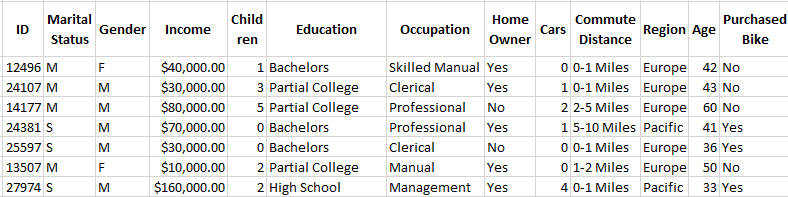
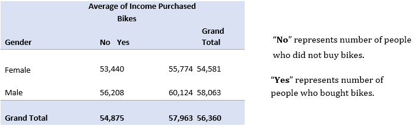
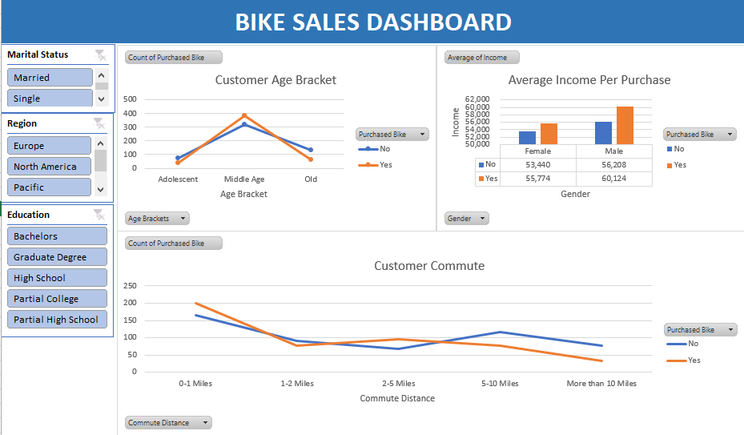

<h1 align="center">Data Analysis on Bike Buyers Dataset</h1>
<h2 align="center">Adams Shittu</h2> 
<h4 align="center">08-10-2022</h4> 
<h4 align="center">Download workbook of the entire analysis <a href="https://github.com/shittuadams/excel-data-analysis-project-on-bike-buyers-dataset/blob/main/Bike%20Buyers%20Dataset%20Analysis.xlsx" target="_blank">here</a>.</h4>

<h3>Business Task</h3> 

The purpose of this analysis is to gain insights into how customers’ age, income and commute affect their level of purchase of bikes.
 
<h3>Data Sources</h3> 

The data source was found online – https://bit.ly/3ypdkow (Alex the Analyst). This dataset is adopted for practice purposes only.

A summary of the dataset is as follows:

    

<h3>Data Analysis Tool</h3>

Microsoft Excel was used for the analysing this dataset.
 

<h3>Data Cleaning</h3>

The following data cleaning steps were observed:
 
<ol>
   <li>The excel workbook is categorized into five sheets. ReadMe, Dashboard, Pivot Table, Working Sheet, bike_buyers_dataset. The working sheets tab contains the cleaned data from the bike_buyers_dataset. </li>
   <li>The filter feature was applied in other to easily observe the entries per field. </li>
   <li>Duplicates were removed.</li>
   <li>The fine and replace feature of excel was used to replace “M” and “S” to “Married” and “Single” respectively in the Marital Status field. The same was done to “M” and “F” in the gender field which was changed to “Male” and “Female” respectively. </li>
   <li>A new column titled “Age Brackets” was created and the “IF” condition was applied to group the ages in the “Age” field into groups of “Adolescent”, “Middle Age” and “Old”.</li>
</ol>
<h3>Summary of Analysis </h3>

Pivot tables were used to analyse and gain quick insights into the bike buyers dataset.

    

<h3>Visualizations and Key Findings</h3> 

Three pivot tables were created and three charts were derived from each of these tables. The charts are as follows: 

    

The following insights were discovered: 

<ol>
<li>Customers of middle ages bought more bikes than other age brackets.</li>  
<li>The average income of the male customers is higher than that of the female customers. </li> 
<li>The closer the customer commute, the higher the tendency to buy a bike.</li> 
</ol>
<h3>Recommendations </h3>
<ol>
<li>Customers of middle ages should be the focus of marketing campaigns.</li>  
<li>More outlets should be opened in the future in other to reduce the customer commute distance.</li>  
</ol>
